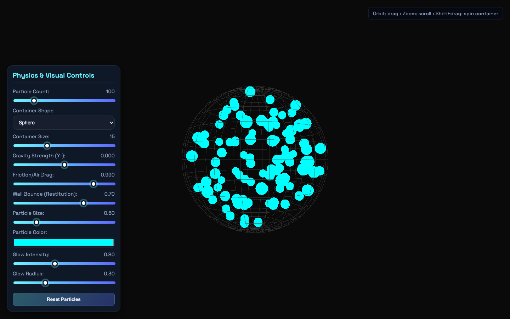

# Browser Particle Physics

Interactive single-page browser particle-physics visual experiment.

## Overview

Standalone HTML particle/physics visual experiment.

## Features

Three.js renders particles inside cube, sphere or pyramid containers. Controls adjust particle count, container size, gravity and appearance; drag to orbit, scroll to zoom, or Shift+drag to spin the container.

## Tech Stack

HTML / CSS / JavaScript / Three.js

## Preview

Running locally in a browser: the particle sandbox with its sphere container and gravity set to zero using the controls.

## Getting Started

Open `particlePhysX.html` in a modern browser with internet access for the pinned Three.js CDN modules and fonts, and use its built-in simulation controls. The application is a single HTML file with embedded styling and JavaScript.

## Validation

Source was inspected; browser rendering, CDN loading and simulation controls were not runtime tested during archival.

## Notes

Original implementation is preserved. Build outputs, dependencies, machine-specific IDE state, backups, submission documents and private runtime data are excluded. No license has been inferred for the original work.
